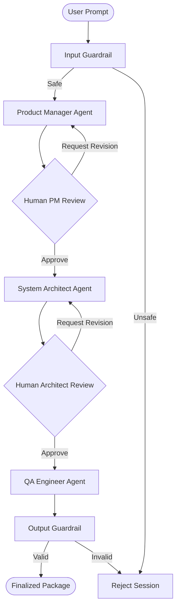

# Multi-Agent PM Orchestrator 🚀

A production-like prototype of a **Multi-Agent Product Management Orchestrator** built using **LangGraph**, **LangChain**, and **FastAPI**. It features iterative building blocks, security guardrails, state persistence, and a real-time **Human-in-the-Loop** review dashboard wrapped in a sleek, matrix-inspired green-and-black theme.

---

## 🗺️ System Architecture

The orchestrator utilizes **LangGraph** to model the PM workflow as a state machine. It contains sequential nodes for draft generation and pauses execution using interrupts to await human supervisor approval before proceeding or looping back for revisions.



---

## ✨ Key Features

* **Agentic State Machine:** Modeled using LangGraph to guarantee strict step execution and state persistence across restarts.
* **Human-in-the-Loop Intercepts:** Pause the workflow at critical review stages (PRD, Technical Design Specs) to let supervisors review drafts, inject feedback, and request active document revisions.
* **Context-Aware Revisions:** The LLM reads your feedback *alongside the previous draft* to iteratively edit your documents instead of writing them from scratch.
* **Security Guardrails:** Pre-execution input validation and post-execution output content verification.
* **OpenRouter Free Tier Fail-safe:** Optimized with token caps and timeout configurations to run smoothly on free-tier models (e.g. `tencent/hy3:free`, `google/gemma-4-26b-a4b-it:free`) without rate limits or billing errors.
* **High-Tech Matrix Theme:** Sleek dark-mode dashboard with pulsing progress nodes, log timelines, and real-time polling synchronizations.

---

## 🛠️ Installation & Setup

### 1. Clone & Prepare
Open your terminal in the project directory:
```bash
git clone <your-repository-url>
cd Multi-Agent-Product-Management-Orchestrator
```

### 2. Configure Environment Keys
Create a file named `.env` in the root folder of the project:
```env
OPENROUTER_API_KEY=your_openrouter_api_key_here
```

### 3. Install Dependencies
```bash
pip install -r requirements.txt
```

### 4. Run the Application
Start the FastAPI backend server:
```bash
python -m uvicorn app.main:app --reload
```
Once running, open your browser and navigate to:
👉 **[http://localhost:8000](http://localhost:8000)**

---

## 🧪 Testing the Loop (LinkedIn Demo Idea)

To showcase the Human-in-the-Loop revision mechanics:
1. **Initialize:** Type a short prompt in the sidebar: `Build a simple notes app` and click **Start Orchestrator**.
2. **Review Draft:** Wait for the PM Agent to complete the Product Requirement Document (PRD).
3. **Submit Feedback:** In the revision box, type:
   `Add folders password protection, offline cloud sync, and audio voice memos.`
   and click **Request Revision**.
4. **Watch it update:** The dashboard will show a `Processing...` loading spinner. The PM Agent will revise the PRD to include these exact features and display the updated draft on your screen!

---

## 📂 Project Structure

```text
├── app/
│   ├── static/
│   │   ├── app.js          # Polling synchronization & tab layout logic
│   │   ├── index.css       # Glowing Matrix theme CSS styles
│   │   └── index.html      # Workspace layout
│   ├── agents.py           # LLM API configuration & Mock fallbacks
│   ├── graph.py            # LangGraph workflow map & conditional edges
│   ├── guardrails.py       # Input/Output validation regex
│   ├── main.py             # FastAPI REST endpoints & background runner
│   └── state.py            # AgentState TypedDict structure
├── requirements.txt        # Backend dependencies
└── README.md               # Project documentation
```
